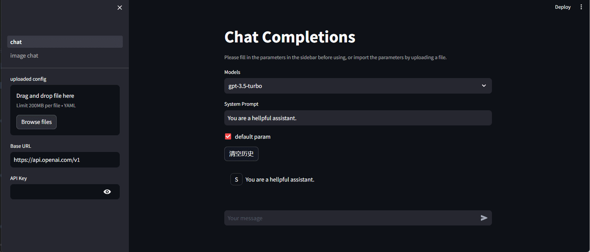

# chat-openai-streamlit
基于streamlit编写，支持openai接口的各类语音模型的交互web应用

## 0. 目标

- [x] 支持Chat Completions API 的页面，进行文本对话
- [x] 支持Vision的页面，进行图像理解

其他添加的小功能

- [x] chat页面每次对话后显示耗时（配置文件中控制开关）
- [x] chat页面每次对话后显示消耗的token数（配置文件中控制开关）

## 1. 安装依赖

```bash
pip install -r requirements.txt
```

## 2. 运行

```bash
streamlit run ./src/chat.py --server.port 1234
```

## 3. 效果图
下列效果图估计不是最新，最新的示例可以看[这里](https://chat-openai-app-hyvc8yrrwciw24dyizzx73.streamlit.app/)

open对话模型：


本地千文模型：


## 4. 配置文件

默认参数配置文件在`src/config/default.json`中，这里主要说明自定义的参数：
* models：主页上的下拉菜单显示的模型
* num_tokens：是否显示每次对话消耗的token数
* use_time：是否显示每次对话消耗的时间
